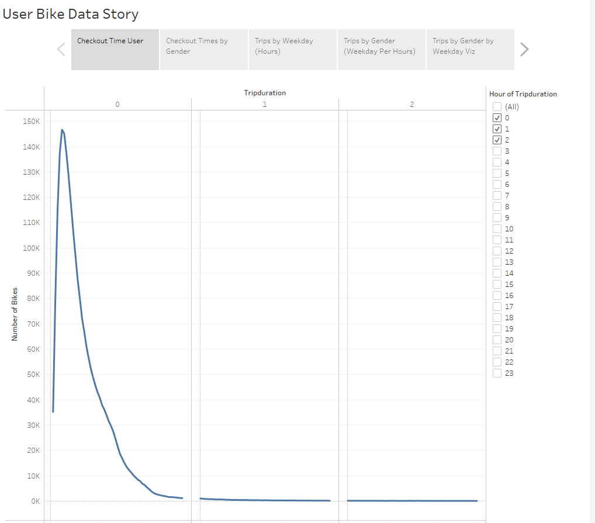
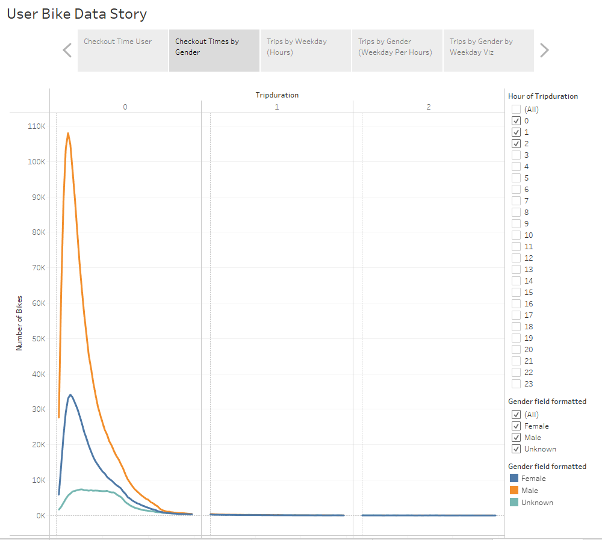
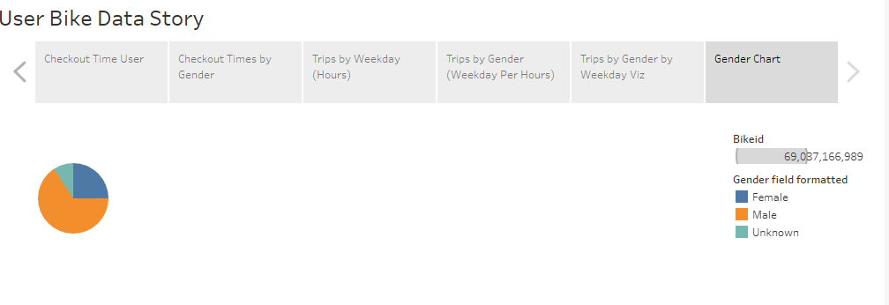
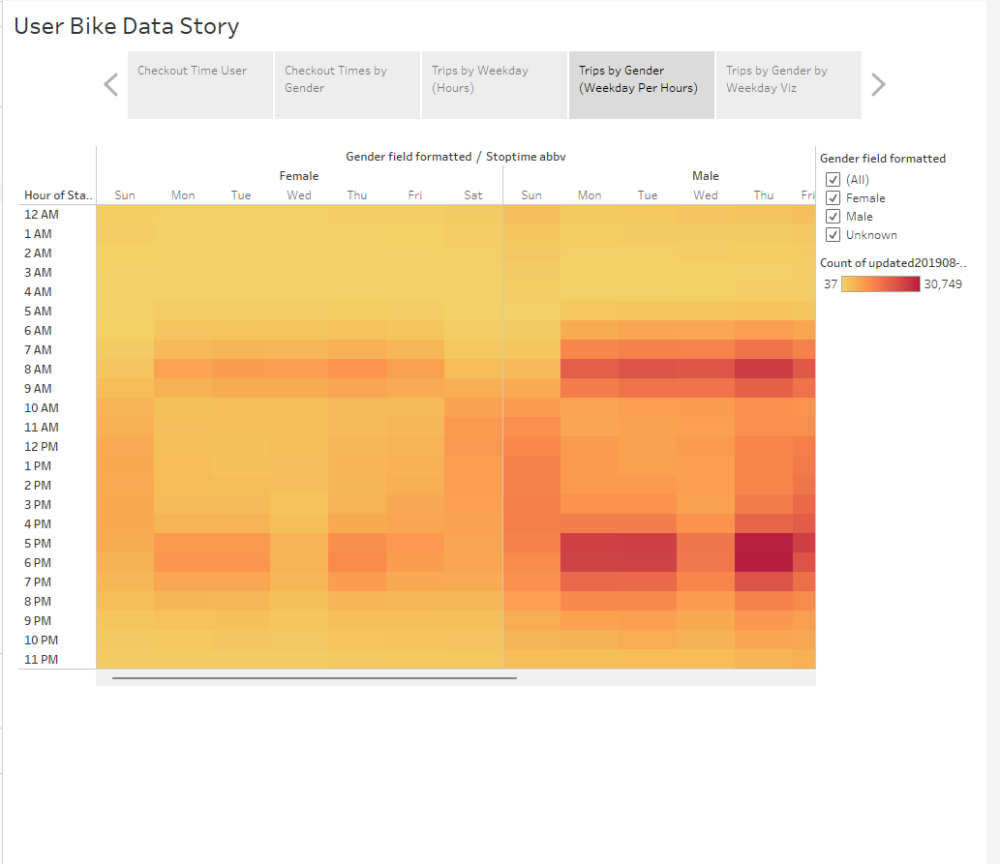
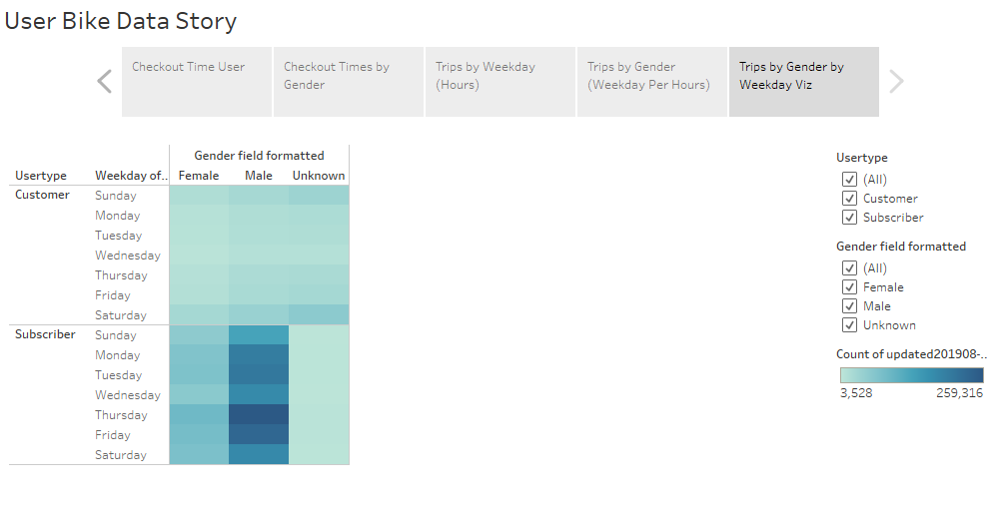
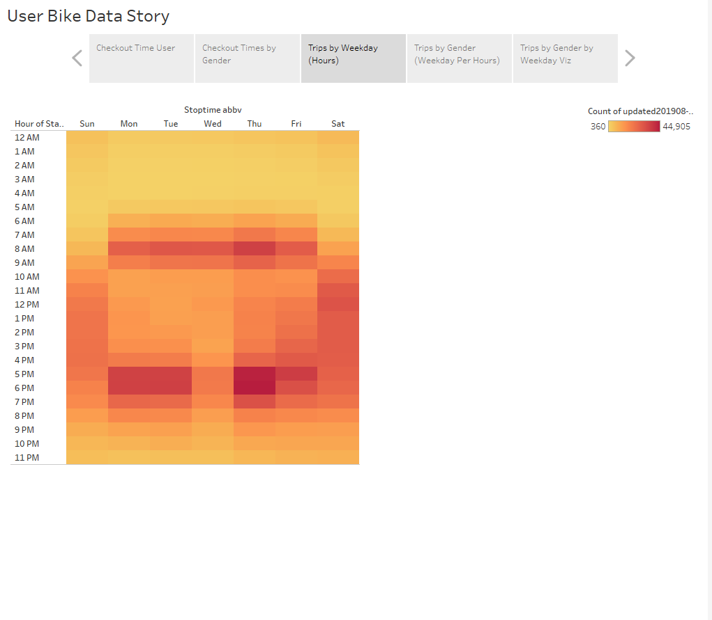
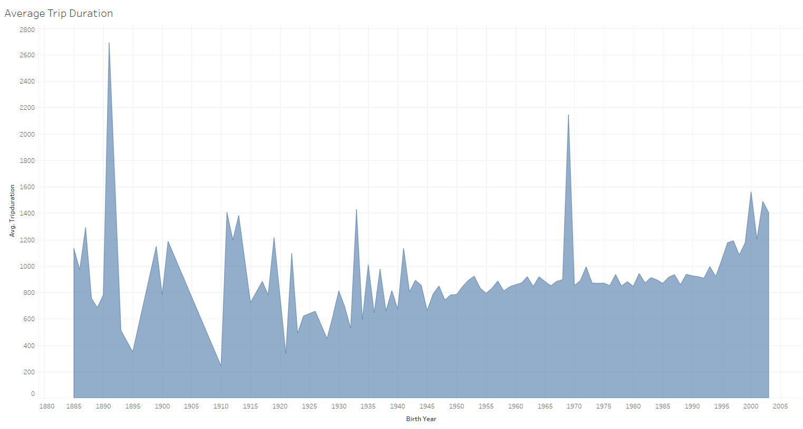

# Bike Sharing (Tableau)

[Dashboard Link](https://public.tableau.com/app/profile/anthony.bahena/viz/BikeSharing_16776292278030/UserBikeDataStory?publish=yes)

## Project Overview
Using tableau we are able to import biker data to analyze August rides for accurate marketing and maintanance.

## Overview of the statistical analysis
The bike riding data from the most Popular summer month gives us a clear way to indicate the prefeerred user base to market to and that seems to be Males born after 1955 as they are more likely to become subscribers.
Here we can see the checkout time by user and how each user is more likely to ride for under an hour.

## Results

In this section we can see that Male riders are more likely to ride than woman.

Visually in the pie chart we can see that it is well over half of the user base is male.

The most popular times are during the mornings before work and the evenings after work. 

In this section we can see that Males are also more likely to pay the subscirption fees and the highest usage day for males is Thursday.

Here we can see overall the highest usage is on Thursday so this day should be avoided for maintanance.

Here we can see that the avg user is born after 1955.

## Summary

Biker data shows that Males are more likely to use the biking service in the morning before work and in the evenings after work. It is also a good indicator that maintanance should be performed early in the AM around 2AM.
